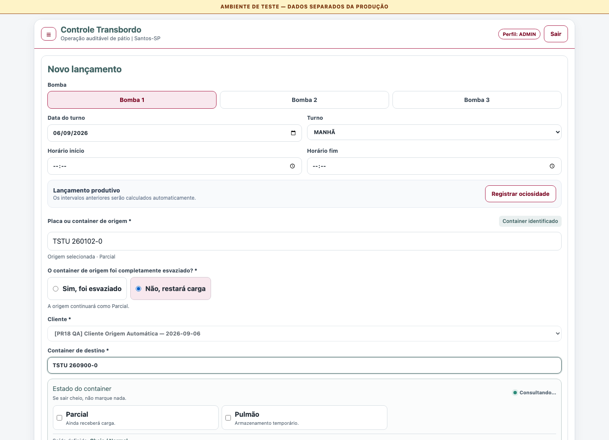
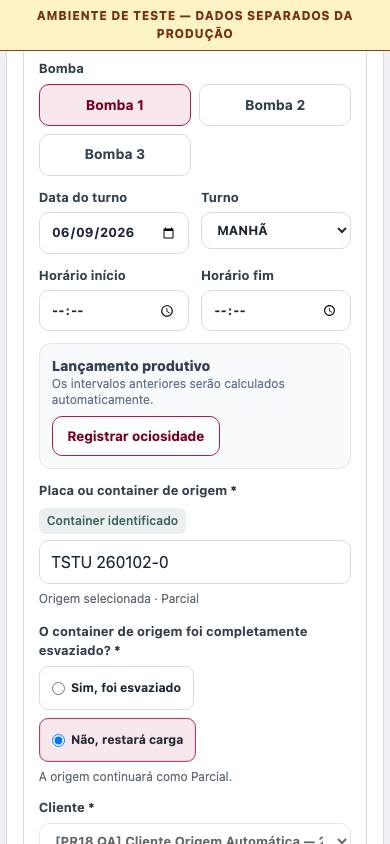

# Homologação da origem automática — PR #18 / 2.5.0

Data: 2026-09-06. Código homologado: `2b6178d6392c6b1b6bee87f433963952c4599493`.

**Escopo desta entrega: staging e revisão.** O responsável solicitou avaliar a
preview antes de autorizar produção. Não houve merge, backfill de produção,
deploy no Firebase App Hosting, tag ou GitHub Release. A base de produção
permanece `20497bae07fd861a355000ed613a380d32dc149e` / 2.4.0.

## Aplicação publicada

- Projeto Firebase confirmado: `line-transbordo-staging-382612`.
- Vercel: projeto `novo-transbordo-staging`, destino `preview`.
- [Origem automática habilitada](https://novo-transbordo-staging-5oov7flkh-caissara2devs-projects.vercel.app/events): `dpl_BNVf6BWinpUSshsAwz5m2f3wkR1D`, `READY`, flag `true`.
- [Recuperação compatível](https://novo-transbordo-staging-2l8dntyj6-caissara2devs-projects.vercel.app/events): `dpl_GtyW8xwAC8XCfkAPrH1NKEcXQAvC`, `READY`, mesmo código, flag `false`.

As previews usam a autenticação normal do Firebase e o banner de ambiente de
teste. A proteção de acesso da Vercel é adicional ao login do aplicativo; um
link compartilhado temporário foi entregue ao responsável. Credenciais e
cookies não fazem parte deste repositório. As rotas, mocks, sessão e fixtures
do laboratório A/B não foram incorporados à aplicação.

## Gate automatizado

`npm run verify` completo aprovado com Node 22 e Java 21:

| Verificação | Resultado |
| --- | --- |
| Unitários e integração | 373 aprovados / 51 arquivos |
| Regras Firestore no emulador | 17 aprovados |
| Playwright E2E | 15 aprovados |
| Cobertura statements / branches | 92,10% / 84,02% |
| Cobertura functions / lines | 96,54% / 93,01% |
| Lint, tipos, manifesto de índices | Aprovados |
| Build e separação do bundle server | Aprovados |
| Auditoria de produção | Zero vulnerabilidades |
| Auditoria total | Gate aprovado; 14 avisos em dependências de desenvolvimento (1 baixo, 10 moderados, 3 altos), nenhum crítico |

Os cenários automatizados incluem prefixos indefinidos, placas antiga/Mercosul,
minúsculas/espaços/hífens, colagem/correção/cursor, seleção por teclado,
paginação/resposta atrasada/erro, cliente herdado, destino igual à origem,
fontes inelegíveis, conflitos concorrentes em edição/exclusão/restauração,
reconstrução retroativa, concordância das projeções/backfill e regressão Blend.

- [CI do código homologado](https://github.com/caissara2dev/novo-transbordo/actions/runs/34019652083/job/101449738422): aprovado.
- [CodeQL JavaScript/TypeScript](https://github.com/caissara2dev/novo-transbordo/actions/runs/34019649942/job/101449733436): aprovado.
- [CodeQL Actions](https://github.com/caissara2dev/novo-transbordo/actions/runs/34019649942/job/101449733509): aprovado.

Alterações posteriores restritas a este registro e imagens devem ser
identificadas como documentação; os checks da PR continuam obrigatórios no
commit final. A revisão inicial pulada pelo CodeRabbit por ser draft não constitui revisão
efetiva. A revisão completa posterior foi realizada; a conferência incremental
solicitada após as correções foi bloqueada por limite de revisões (ver abaixo).

## Regras, índices e backfill de staging

Regras publicadas conferem com `firestore.rules`; release
`073b758a-3e01-4f43-9a42-6859484c0aed`. Os índices necessários foram comparados
com o manifesto e estavam `READY`, incluindo a consulta por origem.

| Etapa | Resultado |
| --- | --- |
| Base inspecionada antes das fixtures | 955 eventos / 521 projeções existentes |
| Dry-run | 755 eventos elegíveis, 510 candidatos válidos |
| Exceções legadas | 11 eventos com identificador de container inválido, preservados e reportados |
| Execução | 509 projeções atualizadas; 1 já consistente; 521 documentos finais |
| Segunda execução | 0 gravações; 510 candidatos já consistentes |
| Integridade dos eventos | Os mesmos 955 eventos, sem alterações |

SHA-256 do conteúdo ordenado dos 955 eventos antes/depois do backfill:
`24952a94766d475a2f23cc3ca51a68e0136d0eea182a16c33e8844c24021d2c4`.

As 11 exceções são anteriores ao contrato de origem. Seus eventos e projeções
existentes não foram corrigidos, excluídos ou substituídos. O backfill continua
rejeitando identificadores inválidos nos eventos que já seguem o contrato novo.
A segunda execução terminou com 530 projeções porque as nove projeções de
fixtures foram criadas durante a verificação; seus 510 candidatos da base
anterior não receberam nenhuma escrita.

## Operações reais em staging

Conta e cliente de homologação identificados com `[PR18 QA]`, sem carga real.
Os lançamentos foram realizados pela API autenticada da aplicação publicada;
o navegador fez login pelo formulário normal. Não houve interceptação de
rotas nem substituição de respostas.

| Cenário | Resultado observado |
| --- | --- |
| Pulmão, com carga remanescente | Origem permaneceu `BUFFER` |
| Pulmão, completamente esvaziado | Origem passou a `TRANSFER_EMPTIED` |
| Parcial, com carga remanescente | Origem permaneceu `PARTIAL` |
| Parcial, completamente esvaziado | Origem passou a `TRANSFER_EMPTIED` |
| Histórico bilateral | Mesmo ID de transferência, uma passagem em cada container |
| Busca de origem | Apenas estados elegíveis; duas páginas sem repetir o item |
| Edição retroativa da origem | Alteração Pulmão → Parcial refletida na passagem SOURCE posterior; reversão validada |
| Troca de origem | Linhas do tempo da origem antiga, nova e destino reconciliadas; troca revertida |
| Exclusão/restauração | Pulmão reaberto ao excluir; encerramento restaurado com eventos posteriores presentes |
| Versão selecionada desatualizada | HTTP 409, sem substituição silenciosa da versão |
| Relatório e CSV | Rodada final do fluxo: 10 eventos produtivos do cliente principal, incluindo 4 transferências contadas uma única vez; uma carreta posterior elevou esse cliente a 11 |
| Navegador | Login normal, reconhecimento, seleção explícita, cliente herdado e desktop/celular; sem erro de página ou overflow horizontal |

As duas rodadas de recuperação acrescentaram duas carretas independentes de
homologação. O cenário de ciclos distintos usa outro cliente `[PR18 QA]` e
quatro eventos produtivos. Total final desses dois clientes: **15 eventos
produtivos, incluindo cinco transferências**, além das justificativas
automáticas identificadas. A conta temporária de automação foi desativada após
os testes, suas sessões revogadas e a senha local descartada; fixtures e
auditoria foram preservadas.

## Recuperação compatível

Teste repetido em 2026-09-06, 07:43:38 UTC, no deployment separado com a
flag `false`:

| Operação | Resultado |
| --- | --- |
| `/api/me` | `containerTransfersEnabled: false`; preview principal continuou `true` |
| Histórico e relatório com transferências | Leitura preservada |
| Nova transferência | HTTP 409 com mensagem explícita de indisponibilidade |
| Edição e exclusão de transferência | HTTP 409 com a mesma mensagem |
| Edição de carreta que afeta a linha do tempo de uma transferência | HTTP 409 |
| Restauração de transferência | HTTP 409; fixture restaurada pela preview habilitada ao terminar |
| Criação de carreta independente | Nova criação na versão revisada confirmada às 07:43:54 UTC; projeção `FULL` |
| Cliente principal de QA após nova carreta | 11 eventos produtivos; as mesmas 4 transferências |

O acesso ao deployment de recuperação usou o comando oficial `vercel curl`
para atravessar a proteção da hospedagem, mantendo o token de login normal do
Firebase nas chamadas da aplicação. A autenticação do aplicativo permaneceu
obrigatória.

A estratégia é republicar código que conhece os dois papéis com a flag
desligada, preservando histórico e auditoria. Não usar a versão 2.4.0 como recuperação padrão depois de
existirem transferências. Consulte também [operação local](../../OPERACAO_LOCAL.md#recuperação-compatível-após-a-primeira-transferência).

## Ciclos distintos e correções da revisão

O cenário adicional na preview final concluiu às 07:41:03 UTC:

- Um container passou por Pulmão, fechamento e novo ciclo Parcial, do mesmo cliente.
- Criar uma transferência no horário do ciclo antigo, tendo selecionado o atual,
  retornou 409 tanto com esvaziamento quanto com carga remanescente; a projeção
  e sua versão permaneceram intactas.
- Transferir no horário do ciclo selecionado foi aceito; o histórico manteve
  o ciclo correto e o estado Parcial.
- Mover essa transferência para o ciclo antigo por edição foi rejeitado.

O formulário envia o ciclo junto da versão observada. Edição/restauração
histórica preservam o ciclo original; atualizar a versão não troca o vínculo.
O campo esperado não é persistido.

A revisão completa do CodeRabbit em `51014bb` produziu seis apontamentos. Cinco
foram tratados em `2b6178d`: limites de leitura com sentinela e rejeição explícita,
tratamento de passagens inconsistentes com avisos, preservação de esvaziamento
nulo, rollback das versões no fake de testes e timestamps coerentes na fixture.
A proposta de filtrar histórico por autor foi respondida com o contrato
compartilhado preexistente; a documentação geral foi esclarecida. Aliases do
domínio e leituras independentes em paralelo também foram ajustados.

O Codex do GitHub identificou o vínculo de ciclo e confirmou ausência de novos
problemas maiores após `880a1f5`. As revisões locais de **Standards** e **Spec**
conferiram as correções seguintes, sem achados pendentes no escopo revisado.

**Pendência externa:** o pedido de revisão incremental do CodeRabbit no código
corrigido recebeu `Review rate limited` às 07:38:47 UTC. O status verde desse
check não equivale à revisão do commit final. Repetir a conferência quando o
limite permitir, antes de qualquer merge. A PR permanece aberta e sem merge
automático; o responsável reservou produção para depois de avaliar a preview.

[Resultados estruturados sem credenciais](results.json).

## Evidências visuais

Capturas da aplicação publicada, com dados fictícios identificados de staging.

## Continuação reservada ao responsável

Avaliar a preview e a revisão da PR. Somente após nova autorização: preparar
`line-transbordo`, registrar a versão estável, validar regras/índices `READY`,
revisar dry-run e contagens do backfill de produção, executar o backfill
idempotente, incorporar a PR, acompanhar Firebase App Hosting, realizar smoke
test sem fixtures e publicar `v2.5.0`. Nenhuma dessas ações de produção foi
executada nesta homologação.
